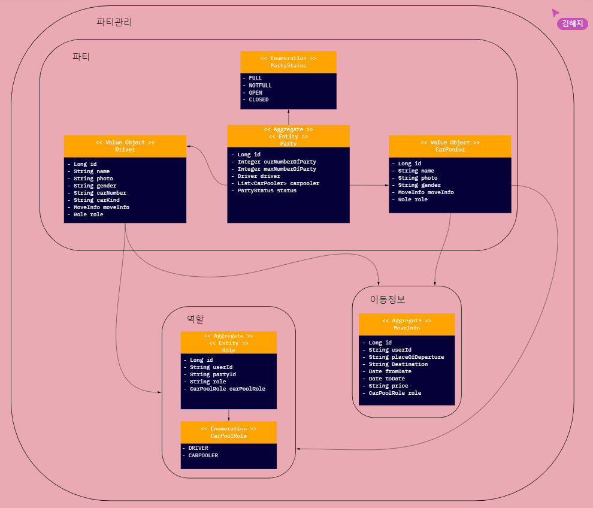

## 클래스 다이어그램


# PartyManagement

## Running in local development environment

```
mvn spring-boot:run
```

## Packaging and Running in docker environment

```
mvn package -B -DskipTests
docker build -t username/PartyManagement:v1 .
docker run username/PartyManagement:v1
```

## Push images and running in Kubernetes

```
docker login 
# in case of docker hub, enter your username and password

docker push username/PartyManagement:v1
```

Edit the deployment.yaml under the /kubernetes directory:
```
    spec:
      containers:
        - name: PartyManagement
          image: username/PartyManagement:latest   # change this image name
          ports:
            - containerPort: 8080

```

Apply the yaml to the Kubernetes:
```
kubectl apply -f kubernetes/deployment.yaml
```

See the pod status:
```
kubectl get pods -l app=PartyManagement
```

If you have no problem, you can connect to the service by opening a proxy between your local and the kubernetes by using this command:
```
# new terminal
kubectl port-forward deploy/PartyManagement 8080:8080

# another terminal
http localhost:8080
```

If you have any problem on running the pod, you can find the reason by hitting this:
```
kubectl logs -l app=PartyManagement
```

Following problems may be occurred:

1. ImgPullBackOff:  Kubernetes failed to pull the image with the image name you've specified at the deployment.yaml. Please check your image name and ensure you have pushed the image properly.
1. CrashLoopBackOff: The spring application is not running properly. If you didn't provide the kafka installation on the kubernetes, the application may crash. Please install kafka firstly:

https://labs.msaez.io/#/courses/cna-full/full-course-cna/ops-utility

